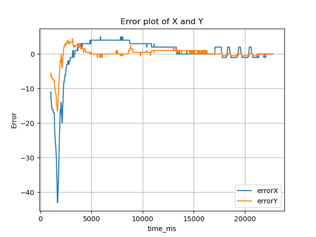
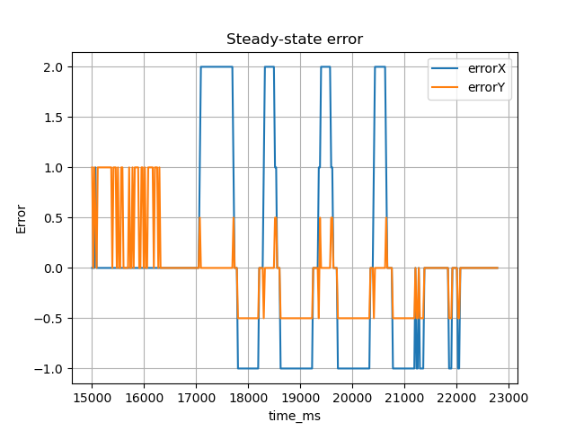

# Two-Axis LED Position Control

## Introduction
This project implements a closed-loop control system to center an LED light source over a series of photoreistors through light intensity feedback. The system consists of two servo motors, that adjusts it position in two dimensions (X, Y). We aim to have the LED stay centered between three photoresistors. 

## Methods
The system is controlled using a PID controller. The system camples analog values from the photoresistors, and calculates the positional error based on differences in the measured light intensity, providing feedback to the motors for adjustments. 

## Setup
The hardware consists of three photoresistors arranged in a triangle, and the LED placed in front of the arrangement.
**Photoresistors(PR)**
- PR1: Bottom.
- PR2: Top left.
- PR3: Top right.

Two degrees of freedom:

PID control demo:

## Calculations
The control logic derives error signals from the intensity differences between sensors:

- **Error X (Horizontal)**: Determines left/right balance.
  $$E_x = PR3 - PR2$$
- **Error Y (Vertical)**: Determines top/bottom balance.
  $$E_y = \frac{PR3 + PR2}{2} - PR1$$

## Results and Discussion

### Steady State Behavior
1.  **PID Convergence**: As the system changes, the derivative and integral components reduce overshoot and drive the steady-state error to zero respectively. 

2.  **Geometric error**: "Zero Error" ($PR1=PR2=PR3$) corresponds to the true geometric center only if all sensors are perfectly matched. If PR1 is 5% more sensitive than the others, the LED will settle further away from PR1 to equalize the readings.

<!-- 3.  **Non-Linearity**:
    - Light intensity follows an inverse-square law ($I \propto 1/d^2$).
    - **Implication**: The system gain is non-linear. The error gradient is steep near the sensors (high sensitivity/stiffness) but flat in the center (low sensitivity).
    - **Result**: The system may be prone to "hunting" or jitter near the edges but susceptible to friction or deadband issues when hovering near the center. -->
